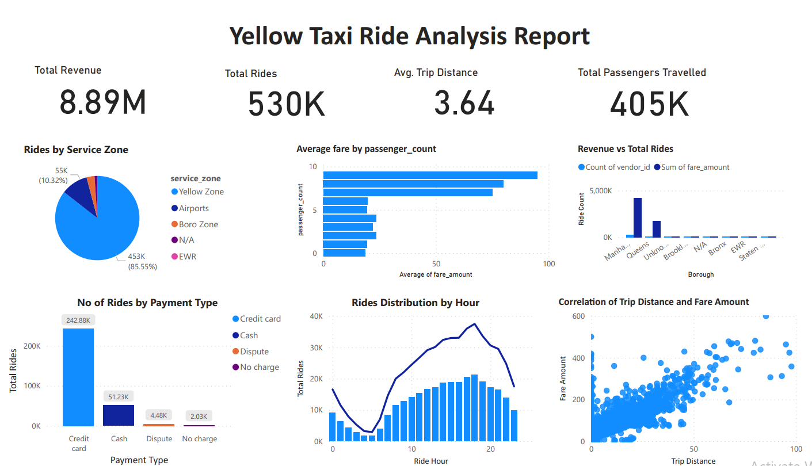
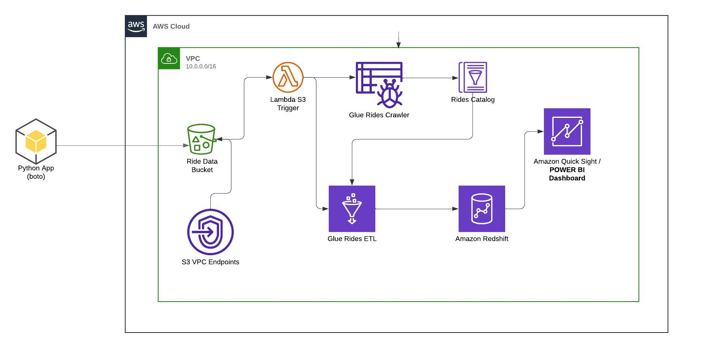
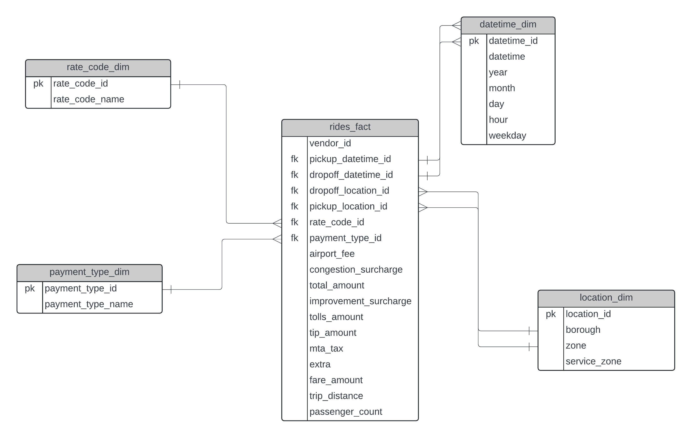
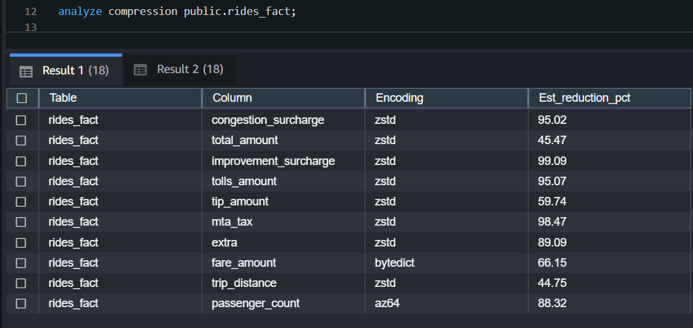

# Yellow Taxi Data Pipeline

- This project aims to develop a full-fledged data pipeline for Yellow Taxi Rides data which will run incrementally. We will receive daily rides data, upload the raw data to the S3 bucket, trigger the lambda to invoke the AWS glue crawler and ETL job to transform the data extracted raw data, and load the processed data into Redshift which will be linked to POWER BI dashboard to help business and marketing teams to get insights from data and make intelligent data-driven decisions.

# Power BI Dashboard

- `AWS Redshift` data warehouse was integrated with `Power BI` and an `analysis report` was created to give insights into the business and 
marketing teams to make data-driven decisions. Here's a glimpse of the ride analysis dashboard built on the top of this ride data pipeline,

# Data Pipeline Architecture

Following AWS services and tools have been used to build this pipeline
- AWS S3
- AWS Lambda
- AWS Glue
- AWS Redshift
- Power BI

# Dimensional Modelling

Dimensional modeling is one of the most important steps in building a data warehouse. The following data model is built based on the required analysis which can be changed based on further requirements,

# Optimization in Data Model from Redshift Perspective

- Dimension table encodings are set to `AUTO` while fact table encodings are set by analyzing compression reduction from the redshift.
Below we can see the reduction percentage suggested by redshift for the fact table,

- Both the `Ride Fact table` and `datetime dimension table` are distributed and sorted on datetime attribute as currently, the biggest dimension table is datetime to avoid the  `data shuffling`.

- All other dimension tables distribution style is set to `diststyle ALL` to broadcast them on every node and avoid the shuffle because
dimension tables size are small enough to fit them in one node/slice.

- `Primary and Foreign key constraints` are set to optimize the query even though they do not work in Redshift as in traditional RDBMS.

- `Data Types` are set to a minimal appropriate data type per Redshift docs. Also, the data type for the foreign key in the fact table and primary
key in the dimension table kept the same to avoid explicit casting in the query plan.

- `NOT NULL` constraint is also set on foreign and primary keys to avoid explicit NOT NULL check in the query plan.

# Cost Optimization for AWS GLue Jobs

- AWS Glue docker image was built locally to develop and test the pipeline locally.

- AWS glue job minimal compute resource cost is `0.44$/ hour` and if we run our spark job with `10 nodes` and our pipeline 
development takes roughly 5 hours including testing and final deployment then we have to bear the total 
cost of `5*10= 50 hours = 50 * 0.44 = 22$` but in my case, it took `less than 1$ ~ 95% cost reduction` as all the glue pipeline development and testing was done locally by building the `Glue docker image locally`.
